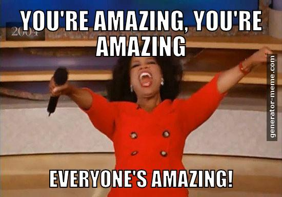
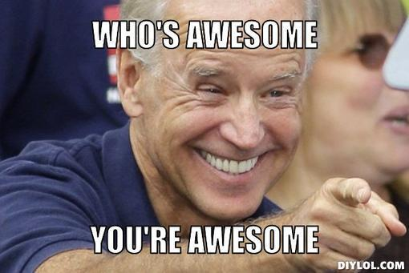

---

# _*So...*_
# [fit] _*How'd you*_ sleep?

---

---

# _*Let's see what you built!*_

---

# [fit] But first, a quick recap

---

# **Why Are We Here?**

- To Learn Something
- To Celebrate Community
- To Cultivate Diversity
- To Have A Good Time

---

## _*Judging*_
- **Theme Alignment:** does the hack support social good, diversity and/or inclusivity?
- **Disrupts** a problem, industry or demographic
- Overall **challenge** to build
- Product innovatively solves a **problem**

---

# **Judging Plan**

---

# _*Judging Part I*_
- Five Minute Pitch
- Up to Five Minutes of Questions
- Three Breakout Areas (Jobs, Gates, Microsoft)
- Three Teams per Room + 1 Wildcard

---

# _*Judging Part II*_
- Ten Teams Pitch
- Fours Finalist Judges
- **PRIZES!**

---

# [fit] _*Breakout Room Assigments*_
# [fit] **bit.do/room-assignments**

---

---

# [fit] **Did I mention...**

---

---

# [fit] **Final Pitches**

---

# [fit] _*Let the deliberation begin...*_

---

# [fit] First, Prizes from **MLH**

---

# [fit] Best **Domain.com** Domain
### _*Domain.com Swag Bags & Goodies*_

---

# [fit] Best use of **Amazon Web Services**
### [fit] _*$250 in AWS Credit for Each Team Member*_

---

# [fit] Best Hack Against Online Harassment
### [fit]_*Hack Harassment Power Bank & One-Pager*_

---