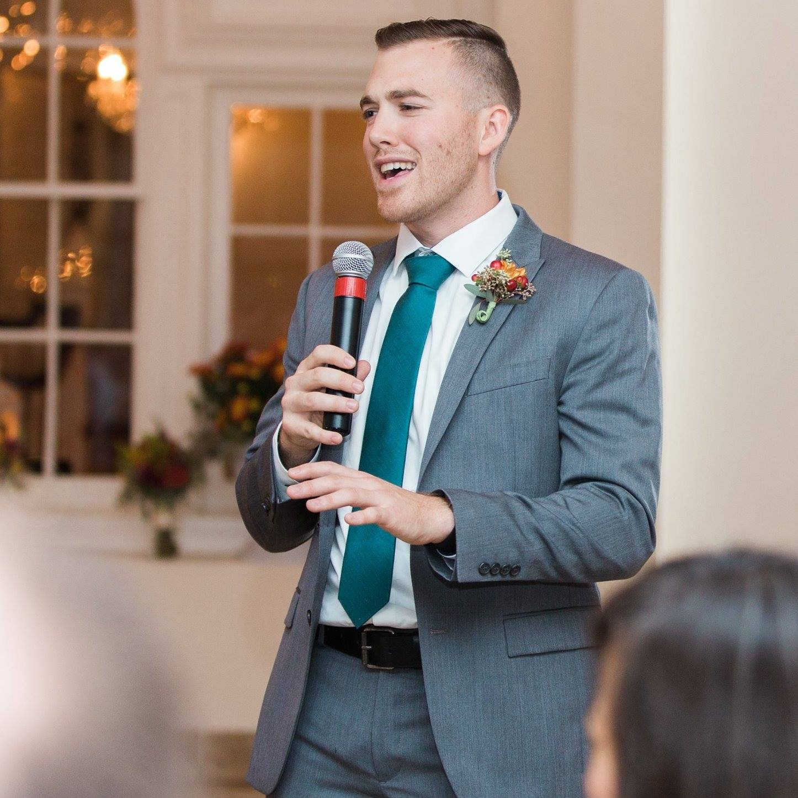

---

# _*Welcome!*_

### We're happy to have you!

---

# Why Are We Here?

- To Learn Something
- To Celebrate Community
- To Cultivate Diversity
- To Have A Good Time

---

# Who Are We?

---

# Amanda Segarra
- Events Manager @ 1776
- Slack: @amanda
- Here to Help

--- 

# Austin Lamon
- Engineer @ Capital One
- Slack: @austin
- Here to Help

---

## What is 
# [fit] _*Disrupt the District?*_

---

## The Hackathon
- 10AM Saturday - 11AM Sunday
- Social Good, Inclusivity, Diversity
- Beneficial Products for All
- Learn, Network, Teach
- First Time Hackers?
- **Slack: disrupt-dc.slack.com**

---

# [fit] A Man Who Lives the Mission

---

# Mark Mathewson

---

# _*Thanks, Mark!*_

---

## Need Technical Help?
- Ask Fellow Hackers!
- `#mentors` on Slack
- Workshops!

---

## Workshop Schedule
11AM: Team Forming
11:30AM: Brainstorming and Validation
1:30PM: Nessie API
2:30PM: iOS
4:30PM: AWS/Lamda
5:30PM: Public Speaking
8PM: Android

---

## [fit] Submission
- disrupt-the-district.devpost.com
- `#submission` on slack

---

## Judging
- **Theme Alignment:** does the hack support social good, diversity and/or inclusivity?
- **Disrupts** a problem, industry or demographic
- Overall **challenge** to build
- Product innovatively solves a **problem**

---

## [fit] Prizes
- 1st Place: Apple Watch
- 2nd Place: GoPro Hero5 Session
- 3rd Place: Amazon Dot

---

## [fit] Thank you!

---

---

---

## [fit] But Seriously...

---

## Code of Conduct
- static.mlh.io/docs/mlh-code-of-conduct.pdf

---

## [fit] Space Rules

---

# [fit] Food Schedule!
## [fit] _**All in the Kitchen to your right!**_

---

## [fit] Saturday
- 9AM: Breakfast
- 12:30PM: Lunch
- 6:30PM:	Dinner
- 12AM: Food Trucks!

---

## [fit] Sunday
- 7AM: Breakfast
- 12PM: Lunch

---

## Event Help
- `#event-help` on Slack
- Registration Desk

---

## **Emergency?** 
- Find Amanda or Austin
- `@austin` or `@amanda` on Slack

---

# [fit] _*Let the Hacking Begin*_
